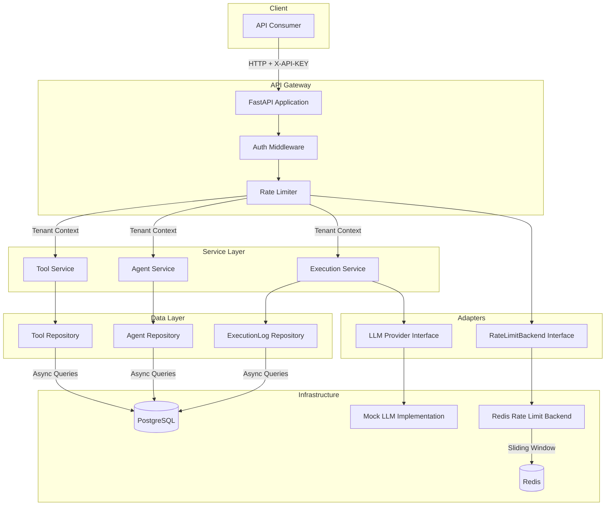

# Mini Agent Platform (MAP)

[](https://www.python.org/downloads/)
[](https://fastapi.tiangolo.com/)
[](https://www.postgresql.org/)
[](https://redis.io/)
[](https://github.com/psf/black)
[](https://opensource.org/licenses/MIT)

A multi-tenant backend platform for managing and executing AI Agents. Built with **FastAPI**, **async PostgreSQL**, and **Redis**, designed for horizontal scalability and strict tenant isolation.

---

## Table of Contents

- [Project Overview](#project-overview)
- [Architecture](#architecture)
- [Key Design Decisions](#key-design-decisions)
- [Quick Start](#quick-start)
- [API Reference](#api-reference)
- [Testing](#testing)
- [Project Structure](#project-structure)

---

## Project Overview

MAP provides a secure, scalable foundation for multi-tenant AI agent orchestration:

| Capability | Implementation |
|------------|----------------|
| **Multi-Tenancy** | Column-based `tenant_id` isolation with repository-level filtering |
| **Async I/O** | Full async/await with SQLAlchemy 2.0 + asyncpg |
| **Rate Limiting** | Redis sliding window (Lua scripts) with pluggable backends - 100 req/min per tenant |
| **AI-Ready** | Abstract LLM provider interface with dependency injection (Mock implementation included) |
| **Audit Trail** | Paginated execution history with tenant scoping |
| **SOLID Principles** | Dependency injection, abstract interfaces, separation of concerns |

---

## Architecture

### High-Level System Architecture


---

## Key Design Decisions

### 1. Multi-Tenancy Strategy

**Approach:** Column-based isolation with `tenant_id` on all tenant-scoped tables.

```python
# Every repository method enforces tenant filtering
statement = select(Tool).where(
    Tool.tenant_id == tenant_id,
    Tool.id == tool_id,
)
```

**Why this approach?**
- **Simplicity**: Single database, single schema - reduces operational overhead
- **Performance**: Proper indexing on `tenant_id` ensures O(log n) lookups
- **Security**: Repository layer acts as a mandatory filter - no query can bypass tenant context
- **Cost-effective**: No per-tenant database provisioning required

**Trade-off acknowledged:** For extremely large tenants with strict compliance requirements, schema-per-tenant or database-per-tenant would provide stronger isolation guarantees.

---

### 2. Rate Limiting: Redis + Lua Scripts

**Approach:** Sliding window counter implemented as an atomic Lua script.

```lua
-- Atomic operations prevent race conditions
redis.call('ZREMRANGEBYSCORE', key, '-inf', window_start)
local count = redis.call('ZCARD', key)
if count < limit then
    redis.call('ZADD', key, now, now .. ':' .. math.random(1000000))
    return {1, limit - count - 1, 0}
end
```

**Why Lua scripts?**
- **Atomicity**: All operations execute in a single Redis transaction
- **No race conditions**: Concurrent requests can't read stale counts
- **Network efficiency**: Single round-trip vs. multiple commands

---

### 3. SOLID Principles & Dependency Injection

The codebase follows SOLID principles with comprehensive dependency injection:

**Dependency Inversion Principle:**
```python
# Abstract interface for LLM providers
class LLMProvider(ABC):
    @abstractmethod
    async def generate(self, agent, prompt, model, temperature, max_tokens) -> str:
        pass

# Services depend on abstractions, not concrete implementations
class ExecutionService:
    def __init__(self, session: AsyncSession,
                 llm_provider: LLMProvider,  # ← Abstract interface
                 rate_limiter: RateLimiter):
        self.llm_provider = llm_provider
```

**Benefits:**
- **Testability**: Services accept mocked dependencies via constructor
- **Flexibility**: Swap Redis for in-memory rate limiter without changing service code
- **Open/Closed**: Add new LLM providers (OpenAI, Claude) without modifying ExecutionService

**Architecture Layers:**
```
Routes → Services (DI) → Repositories → Database
         ↓
    Adapters (Abstract Interfaces)
         ↓
    Implementations (Redis, Mock LLM, etc.)
```

---

## Quick Start

### Prerequisites

- [Docker](https://docs.docker.com/get-docker/) (20.10+)
- [Docker Compose](https://docs.docker.com/compose/install/) (v2+)

### One-Command Setup

```bash
docker compose up --build
```

This starts:
- **PostgreSQL 15** on port `5432`
- **Redis 7** on port `6379`
- **FastAPI application** on port `8000`

Migrations run automatically on startup.

### Verify Installation

```bash
# Health check
curl http://localhost:8000/health

# Expected response:
# {"status":"healthy","service":"Mini Agent Platform","version":"1.0.0"}
```

### Interactive API Documentation

- **Swagger UI**: http://localhost:8000/docs
- **ReDoc**: http://localhost:8000/redoc

---

## API Reference

### Authentication

All endpoints (except `/health`) require the `X-API-KEY` header.

**Security Implementation:**
- API keys are stored as **SHA-256 hashes** 
- Keys include a **prefix** (e.g., `tenant-a-ke...`) for debugging without exposing the full key
- **`last_used_at`** timestamp provides audit trail for key usage
- Keys and tenants support **deactivation** for immediate revocation

**Demo Keys (pre-seeded):**

| Tenant | API Key | Purpose |
|--------|---------|---------|
| A | `tenant-a-key` | Production demo key |
| A | `tenant-a-test-key` | Test key |
| B | `tenant-b-key` | Production demo key |
| B | `tenant-b-test-key` | Test key |

### Endpoints Overview

| Method | Endpoint | Description |
|--------|----------|-------------|
| `GET` | `/health` | Health check (no auth) |
| `POST` | `/api/v1/tools` | Create a tool |
| `GET` | `/api/v1/tools` | List tools |
| `GET` | `/api/v1/tools/{id}` | Get tool by ID |
| `PUT` | `/api/v1/tools/{id}` | Update tool |
| `DELETE` | `/api/v1/tools/{id}` | Delete tool |
| `POST` | `/api/v1/agents` | Create an agent |
| `GET` | `/api/v1/agents` | List agents |
| `GET` | `/api/v1/agents/{id}` | Get agent by ID |
| `PUT` | `/api/v1/agents/{id}` | Update agent |
| `DELETE` | `/api/v1/agents/{id}` | Delete agent |
| `POST` | `/api/v1/agents/{id}/run` | Execute an agent |
| `GET` | `/api/v1/history` | Get execution history |

### Example: Complete Workflow

#### 1. Create a Tool

```bash
curl -X POST http://localhost:8000/api/v1/tools \
  -H "X-API-KEY: tenant-a-key" \
  -H "Content-Type: application/json" \
  -d '{
    "name": "web_search",
    "description": "Search the web for real-time information"
  }'
```

**Response:**
```json
{
  "id": "550e8400-e29b-41d4-a716-446655440000",
  "name": "web_search",
  "description": "Search the web for real-time information",
  "created_at": "2024-01-15T10:30:00Z",
  "updated_at": "2024-01-15T10:30:00Z"
}
```

#### 2. Create an Agent with Tools

```bash
curl -X POST http://localhost:8000/api/v1/agents \
  -H "X-API-KEY: tenant-a-key" \
  -H "Content-Type: application/json" \
  -d '{
    "name": "Research Assistant",
    "role": "researcher",
    "description": "An AI agent specialized in research tasks",
    "tool_ids": ["550e8400-e29b-41d4-a716-446655440000"]
  }'
```

#### 3. Execute the Agent

```bash
curl -X POST http://localhost:8000/api/v1/agents/{agent_id}/run \
  -H "X-API-KEY: tenant-a-key" \
  -H "Content-Type: application/json" \
  -d '{
    "prompt": "Find the latest trends in AI agent frameworks",
    "model": "gpt-5",
    "temperature": 0.7,
    "max_tokens": 1000
  }'
```

**Optional Parameters:**
- `temperature` (0.0-2.0, default: 0.7) - Controls randomness
- `max_tokens` (1-4096, optional) - Limits response length

**Response Headers:**
```
X-RateLimit-Limit: 100
X-RateLimit-Remaining: 99
X-RateLimit-Window: 60
```

**Response Body:**
```json
{
  "execution_id": "...",
  "agent_id": "...",
  "agent_name": "Research Assistant",
  "model": "gpt-5",
  "prompt": "Find the latest trends in AI agent frameworks",
  "response": "[Mock Response] Agent 'Research Assistant' (role: researcher) processed your request using tools: [web_search]... [temp=0.7, max_tokens=1000]",
  "tools_available": ["web_search"],
  "executed_at": "2024-01-15T10:35:00Z"
}
```

### Error Response Format

All errors follow a consistent structure:

```json
{
  "error_code": "TENANT_ISOLATION_VIOLATION",
  "message": "Access denied to resource owned by another tenant",
  "details": {
    "resource_type": "agent",
    "resource_id": "550e8400-e29b-41d4-a716-446655440000"
  }
}
```

---

## Testing

### Test Coverage

The project includes **170+ comprehensive tests** covering:

| Category | Files | Coverage |
|----------|-------|----------|
| **Unit Tests** | 10 files | All services, adapters, schemas, exceptions |
| **Service Layer** | 70 tests | RateLimiter, AuthService, ExecutionService, AgentService, ToolService |
| **Adapters** | 32 tests | MockLLMAdapter, InMemoryRateLimitBackend |
| **Schemas** | 15 tests | Request validation, field constraints |
| **Exceptions** | 27 tests | All exception classes and HTTP status codes |
| **Integration** | API tests | Multi-tenant isolation, rate limiting |

### Run Full Test Suite

```bash
# Using Docker
docker compose run api pytest tests/ -v

# Local (requires PostgreSQL and Redis)
pytest tests/ -v --cov=app --cov-report=term-missing
```

### Test Categories

```bash
# Unit tests only 
pytest tests/unit/ -v

# Integration tests
pytest tests/integration/ -v

# Contract tests (API behavior)
pytest tests/contract/ -v
```

---

## Project Structure

```
mini-agent-platform/
├── app/
│   ├── main.py                    # FastAPI application entry point
│   ├── config.py                  # Pydantic settings management
│   ├── database.py                # Async SQLAlchemy engine & session
│   ├── dependencies.py            # FastAPI dependency injection factories
│   ├── exceptions.py              # Custom exception hierarchy
│   ├── logging_config.py          # Structured logging setup
│   ├── models/                    # SQLModel entity definitions
│   │   ├── base.py                # TenantModel base class
│   │   ├── tenant.py              # Tenant entity
│   │   ├── api_key.py             # API key with SHA-256 hashing
│   │   ├── tool.py
│   │   ├── agent.py
│   │   └── execution_log.py
│   ├── schemas/                   # Pydantic request/response schemas
│   │   ├── execution.py           # Includes temperature, max_tokens
│   │   └── ...
│   ├── repositories/              # Data access layer (tenant-filtered)
│   ├── services/                  # Business logic layer
│   │   ├── tool_service.py
│   │   ├── agent_service.py
│   │   ├── execution_service.py   # DI with LLMProvider & RateLimiter
│   │   ├── auth_service.py        # API key validation
│   │   ├── rate_limiter.py        # Rate limiter with pluggable backend
│   │   ├── rate_limit_backend.py  # Abstract interface
│   │   ├── rate_limit_redis.py    # Redis implementation
│   │   └── rate_limit_memory.py   # In-memory for testing
│   ├── routes/                    # API endpoint handlers
│   ├── middleware/                # Global exception handlers
│   └── adapters/                  # External service adapters
│       ├── llm_provider.py        # Abstract LLM interface
│       └── mock_llm.py            # Mock implementation
├── alembic/                       # Database migrations
├── tests/
│   ├── unit/                      # 170+ tests covering all services
│   │   ├── test_rate_limiter.py
│   │   ├── test_auth_service.py
│   │   ├── test_execution_service.py
│   │   ├── test_agent_service.py
│   │   ├── test_tool_service.py
│   │   └── ...
│   ├── integration/
│   └── contract/
├── docker-compose.yml
├── Dockerfile
├── requirements.txt
└── README.md
```

---

## Supported Models

The following models are accepted by the `/run` endpoint:

- `gpt-4o-mini`
- `gpt-5`
- `gpt-3.5-turbo`
- `claude-4-opus`
- `claude-4.5-sonnet`
- `gemini-2.5-pro`

> **Note:** The current implementation uses a Mock LLM adapter for deterministic testing. Replace `MockLLMAdapter` with a real provider integration for production use.

---

## Logging

The platform includes structured logging with automatic traceback capture:

**Logged Events:**
- Authentication attempts (success/failure)
- Rate limit violations
- Agent execution start/completion
- Database transaction failures
- All unexpected exceptions with full tracebacks

Logs are written to `logs/app.log` with format: `%(asctime)s - %(name)s - %(levelname)s - %(message)s`

---

## License

MIT License - see [LICENSE](LICENSE) for details.
